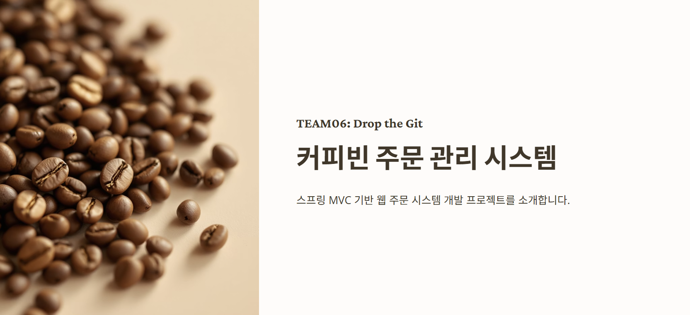

# NBE5-6-1-Team06

  

[DROP THE GIT 팀 1차 프로젝트 일정 관리 (Trello 보드 바로가기)](https://trello.com/b/IdggiMMY/nbe5-6-1-gridscirclecafe)

---

## 🧑‍💻 팀원 소개

  <table >
    <tbody>
      <tr>
        <td align="center"><b>김도윤</b></td>
        <td align="center"><b>안세희</b></td>
        <td align="center"><b>이강현</b></td>
        <td align="center"><b>이초롱</b></td>
        <td align="center"><b>황영준</b></td>
      </tr>
      <tr>
        <td align="center"></td>
        <td align="center"></td>
        <td align="center"></td>
        <td align="center"></td>
        <td align="center"></td>
      </tr>
      <tr>
        <td align="center"><a href="https://github.com/doyun-a"><b>@doyun-a</b></a></td>
        <td align="center"><a href="https://github.com/ash-be"><b>@ash-be</b></a></td>
        <td align="center"><a href="https://github.com/Leeka99"><b>@Leeka</b></a></td>
        <td align="center"><a href="https://github.com/0802222"><b>@0802222</b></a></td>
        <td align="center"><a href="https://github.com/youngjun222"><b>@youngjun222</b></a></td>
      </tr>
    </tbody>
  </table>

 

## 📌 프로젝트 소개

 

## 🛠️ 기술 스택

 

## 📊 ERD 설계

 

## 🗂️ ERD 및 테이블 구조

 

## 📄API 명세서

 

## 🖥️ 주요 화면 (UI)

 

## 🛠️ 트러블 슈팅 & 해결 과정

[프로젝트 문서 보기](readmeresorce/ppt.pdf)

